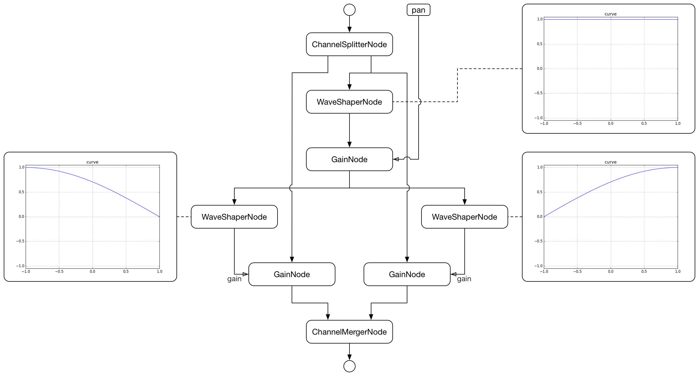

# StereoPannerNode
[](https://travis-ci.org/mohayonao/stereo-panner-node)
[](https://www.npmjs.org/package/stereo-panner-node)
[](http://mohayonao.mit-license.org/)

> StereoPannerNode for legacy Web Audio API

http://webaudio.github.io/web-audio-api/#the-stereopannernode-interface

## Installation

```
npm install stereo-panner-node
```

#### downloads:

- [stereo-panner-node.js](https://raw.githubusercontent.com/mohayonao/stereo-panner-node/master/build/stereo-panner-node.js)
- [stereo-panner-node.min.js](https://raw.githubusercontent.com/mohayonao/stereo-panner-node/master/build/stereo-panner-node.min.js)

## Quick Example

At first, call `polyfill()` method.

```js
require("StereoPannerNode").polyfill();
```

```html
<script src="/path/to/stereo-panner-node.js"></script>
<script>StereoPannerNode.polyfill();</script>
```

Then, you can use `createStereoPanner()` method at AudioContext.

```js
var stereoPanner = audioContext.createStereoPanner();

stereoPanner.pan.value = Math.random() * 2 - 1;
```

#### Demo

https://mohayonao.github.io/stereo-panner-node/

## API
### StereoPannerNode
  - `constructor(audioContext: AudioContext)`

#### Class Methods
  - `polyfill(): void`
    - install `createStereoPanner()` method to `AudioContext.prototype` if needed.
  - `install(): void`
    - install `createStereoPanner()` method to `AudioContext.prototype` force

#### Instance Attributes
  - `pan: AudioParam` _readonly_

## AudioGraph



## License

MIT
